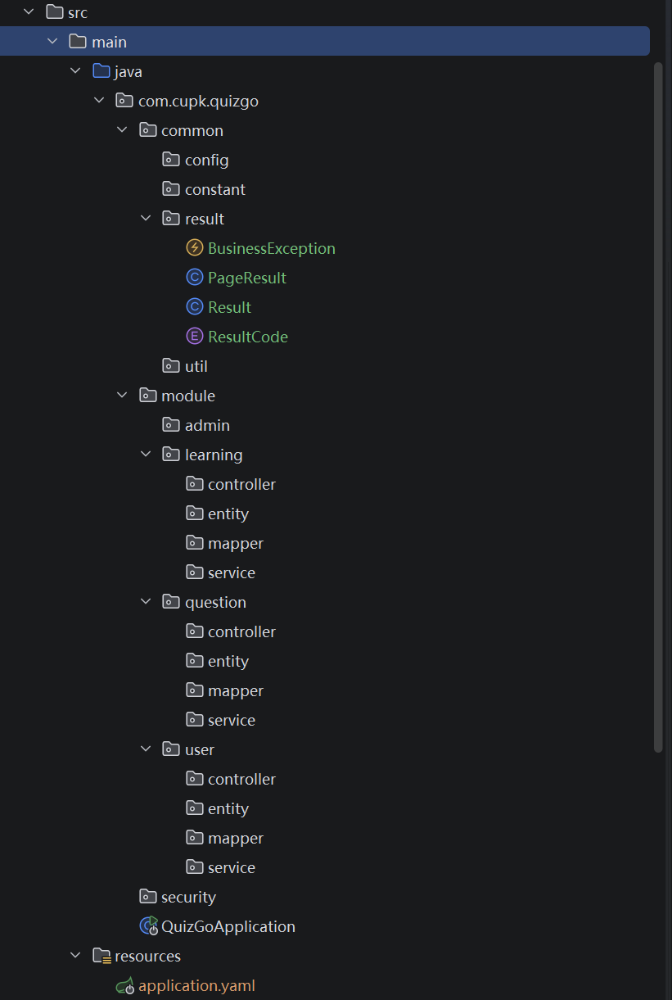

# 运行环境

JDK：17

Maven：3.8+

MySQL：8.0+

Spring Boot：3.5.13

# 分工

| 成员 | 负责模块         | 核心职责                                                     |
| ---- | ---------------- | ------------------------------------------------------------ |
| A    | question 模块    | （后台）题库手动输入及分类标签、维护（修改题目/答案）、批量导入（含分类标签） |
| B    | learning 模块    | 多种刷题模式切换、答题交互逻辑、错题本与收藏功能             |
| C    | user、auth 模块  | 登录、个人中心、权限校验（Spring Security）例如@PreAuthorize("hasAuthority('post:create')") |
| D    | stats、admin模块 | （后台）学习数据分析展示、管理端运维功能（用户管理）         |

# 参考项目架构

```
com.projectname
├── common                // 公共模块：存放工具类、常量、异常处理、基础响应类
│   ├── config            // 公共配置（Swagger, MyBatis-Plus等）
│   ├── constant          // 枚举类（题目类型、难度等级）
│   ├── exception         // 全局异常捕获
│   └── util              // Excel导入工具、加密工具
├── core                  // 核心业务逻辑（按功能模块细分）
│   ├── user              // 2.2.5 用户管理模块
│   │   ├── controller
│   │   ├── entity
│   │   ├── mapper
│   │   └── service
│   ├── question          // 2.2.1 题库管理模块
│   │   ├── controller
│   │   ├── dto           // 题目导入专属DTO
│   │   ├── service
│   │   └── ...
│   ├── learning          // 2.2.2 在线刷题 & 2.2.3 错题本
│   │   ├── controller
│   │   ├── vo            // 刷题结果展示VO
│   │   └── ...
│   ├── stats             // 2.2.4 学习统计模块
│   │   └── ...
│   └── admin             // 2.2.6 管理后台特有逻辑（审核、权限、公告）
│       └── ...
├── security              // 安全模块（登录拦截、Token校验）
└── ProjectApplication.java
```

